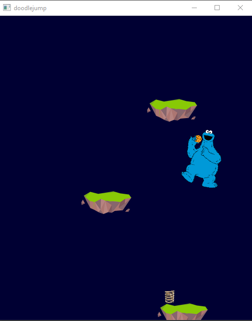

# projinda22
## About

This game is similar to the very popular doodle jump. The player is controlled by the left and right arrow keys and the goal is to reach as high as possible by jumping on the platforms. This game has been created with help from the java game development framework [libGDX](https://libgdx.com/). 

## Running
- [Setup development environment](https://libgdx.com/wiki/start/setup)
- [Importing & running project](https://libgdx.com/wiki/start/import-and-running)
